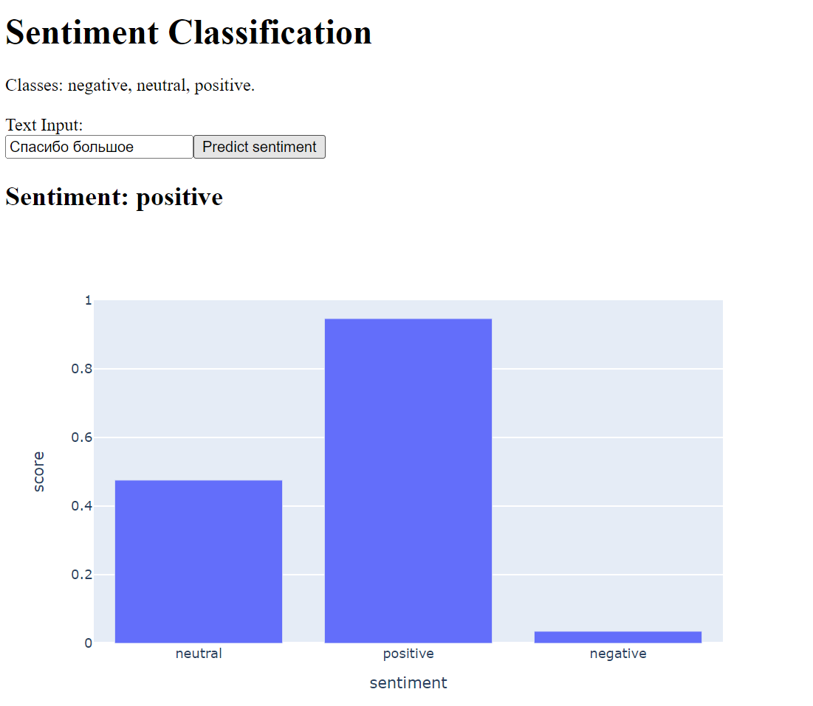

# Проект для курса "Архитектура компьютерных сетей"

## Описание
Проект предоставляет web интерфейс для модели многоклассовой классификации для задачи сентимент анализа.  
Модель: [cointegrated/rubert-tiny-sentiment-balanced](https://huggingface.co/cointegrated/rubert-tiny-sentiment-balanced)

## Запуск сервиса
- Создаём виртуальное окружение (Python 3.9.10)
- Устанавливаем зависимости  
    ```pip install -r requirements.txt```
- Запускаем backend  
    ```python app/main.py```
- Запускаем frontend  
    ```python frontend_app/dash_app.py```
- После запуска сервис доступен по ссылке http://127.0.0.1:9131/


## Интерфейс сервиса  


